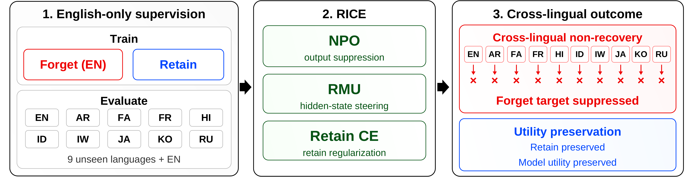
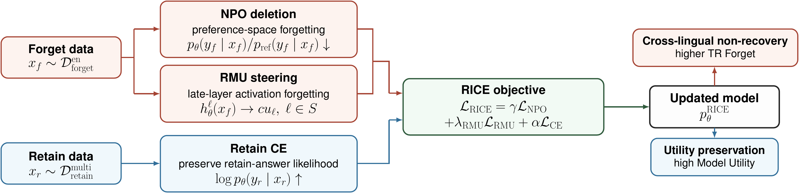
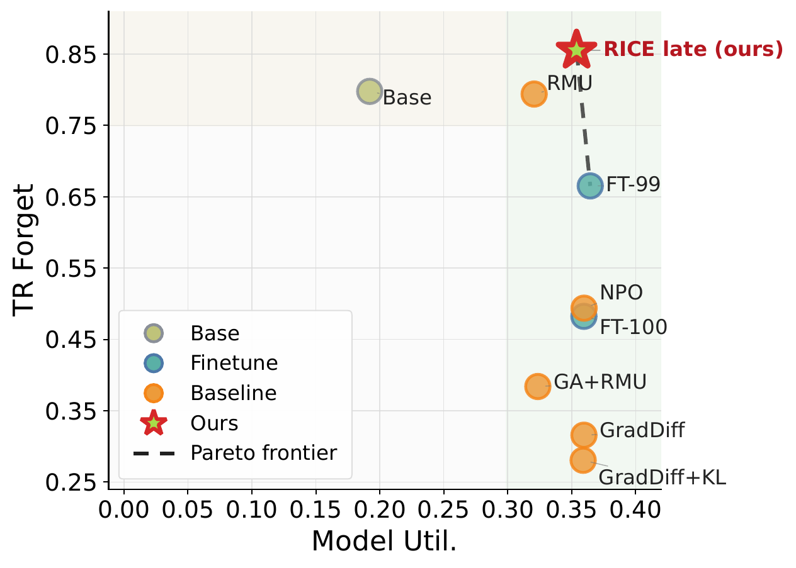
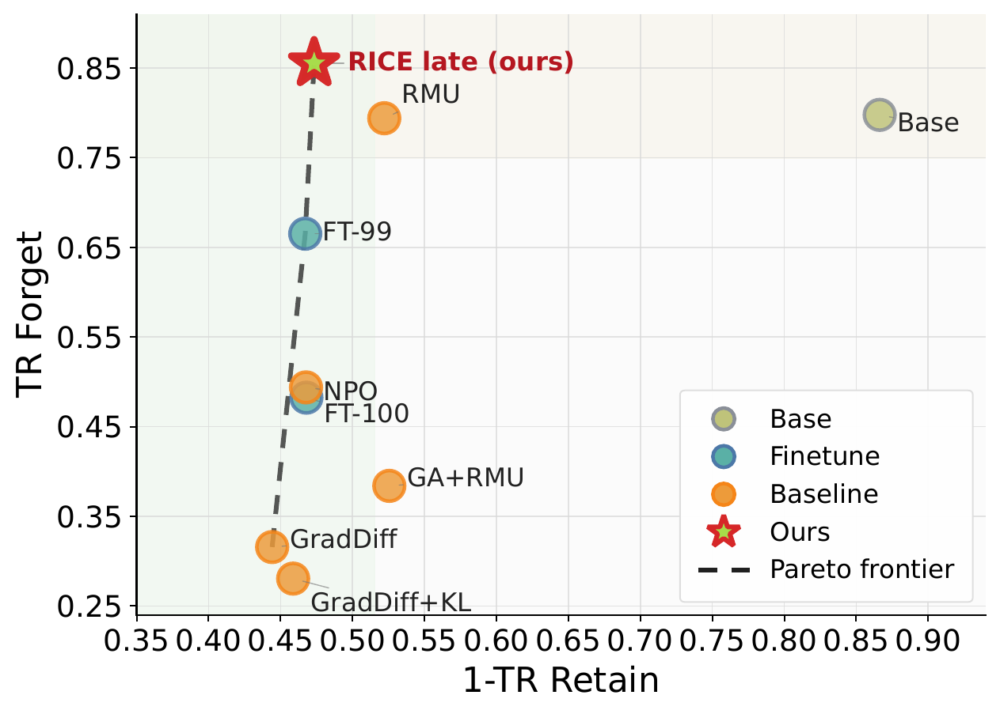

# RICE: Reference-guided Internal Cross-lingual Erasure for Multilingual LLM Unlearning

📢 2026년 1학기 [AIKU](https://github.com/AIKU-Official) 활동으로 진행한 프로젝트입니다

## 소개

RICE는 다국어 대규모 언어 모델에서 특정 사실을 삭제하면서도 삭제 대상이 아닌 지식과 언어 능력을 최대한 보존하기 위한 머신 언러닝 프로젝트입니다.

기존 언러닝 방법은 영어에서 삭제한 정보가 다른 언어 질의에서 다시 복구되거나, 반대로 삭제 강도를 높이면 retain 성능까지 크게 훼손되는 문제가 있습니다. 이 프로젝트는 영어 `forget01` 데이터만으로 삭제 학습을 수행하고, 아랍어, 페르시아어, 프랑스어, 힌디어, 인도네시아어, 히브리어, 일본어, 한국어, 러시아어까지 포함한 열 개 언어에서 삭제가 유지되는지 평가합니다.



## 방법론

이 프로젝트는 TOFU 기반 사실 삭제 문제를 다음과 같이 정의합니다.

- 삭제 대상 데이터 `forget01`에 포함된 가상 작가 관련 질의응답은 모델이 더 이상 정답으로 선호하지 않아야 합니다.
- 삭제 대상이 아닌 `retain99`, 실제 작가, 실제 세계 지식에 대한 응답 능력은 유지되어야 합니다.
- 삭제 학습은 영어 데이터에만 적용하지만, 평가 시에는 열 개 언어 전체에서 동일한 사실이 복구되지 않아야 합니다.

RICE는 이를 위해 출력 수준 삭제와 표현 수준 삭제를 결합합니다.

1. **NPO(Negative Preference Optimization)**  
   동결된 참조 모델과 학습 중인 모델의 삭제 대상 정답 로그 확률 차이를 이용해 forget answer의 선호도를 낮춥니다. 단순 gradient ascent보다 안정적으로 삭제 압력을 줄 수 있습니다.

2. **RMU(Representation Misdirection for Unlearning)**  
   삭제 데이터가 만드는 hidden state를 선택한 후기 레이어에서 고정된 무작위 방향으로 유도합니다. 출력 확률만 낮추는 것이 아니라 내부 표현 자체에 삭제 신호를 주어 교차언어 복구 가능성을 낮춥니다.

3. **Retain CE(Cross Entropy)**  
   retain 데이터에 대해 일반 causal language modeling loss를 함께 적용합니다. 이 항은 삭제가 모델 전체의 언어 능력과 비삭제 지식으로 번지는 것을 완화합니다.

최종 목적함수는 다음 구조를 따릅니다.

$$
L_{\mathrm{RICE}} = \gamma L_{\mathrm{NPO}} + \lambda_{\mathrm{RMU}} L_{\mathrm{RMU}} + \alpha L_{\mathrm{CE}}
$$

본 저장소는 RICE 실험을 위한 fine-tuning, baseline unlearning, 다국어 평가 파이프라인을 포함합니다. 구현된 주요 실험 코드는 다음과 같습니다.

- `finetune.py`: Qwen3.5-2B 기반 TOFU fine-tuning을 수행합니다.
- `evaluate_util.py`: retain, forget, real author, real world task를 언어별로 평가합니다.
- `unlearning_methods/unlearn_npo`: NPO baseline을 실행합니다.
- `unlearning_methods/unlearn_grad_diff`, `unlearning_methods/unlearn_grad_diff_kl`: GradDiff 계열 baseline을 실행합니다.
- `unlearning_methods/unlearn_LingTea`: source-language unlearning과 cross-lingual propagation 평가를 수행합니다.
- `unlearning_methods/unlearn_sh`, `unlearning_methods/unlearn_author_noise_npo`, `unlearning_methods/unlearn_UNLEARN`, `unlearning_methods/unlearn_wj`: 추가 ablation 및 탐색 실험을 위한 파이프라인입니다.



## 환경 설정

권장 실행 환경은 다음과 같습니다.

- Python 3.9 이상
- NVIDIA GPU 및 CUDA 12.x 환경
- PyTorch, Transformers, DeepSpeed, Datasets, Hydra
- Hugging Face 모델과 데이터셋 접근 권한

가장 간단한 설치 방법은 `requirements.txt`를 사용하는 방식입니다.

```bash
cd implementation
conda create -n rice python=3.10 -y
conda activate rice
pip install -r requirements.txt
```

기존 실험 환경을 최대한 재현하려면 `environment.yml`을 사용할 수 있습니다.

```bash
cd implementation
conda env create -f environment.yml
conda activate tf
```

모델과 데이터셋을 Hugging Face Hub에서 내려받아야 하는 경우에는 로그인 후 실행합니다.

```bash
huggingface-cli login
```

로컬 데이터셋은 기본적으로 `dataset/` 아래에 위치한다고 가정합니다. 주요 데이터 경로는 다음과 같습니다.

- `dataset/full_merged_all_10_lang`: 열 개 언어 전체 fine-tuning 데이터입니다.
- `dataset/retain99_merged_all_10_lang`: `forget01`을 제거한 retain-only fine-tuning 데이터입니다.
- `dataset/forget01_<lang>`, `dataset/retain99_<lang>`: 언어별 forget/retain 데이터입니다.
- `dataset/*_perturbed_<lang>`: Truth Ratio 평가에 사용하는 perturbed split입니다.

## 사용 방법

모든 명령어는 `implementation/` 디렉터리에서 실행합니다.

```bash
cd implementation
```

### 1. retain99 데이터 생성

`retain99_merged_all_10_lang` 데이터가 없는 경우 먼저 생성합니다.

```bash
python build_retain99.py
```

정상 실행 시 총 39,600개 row가 생성되며, 언어별로 3,960개 row가 retain 데이터로 남습니다.

### 2. 전체 데이터 fine-tuning

전체 다국어 TOFU 데이터로 기본 fine-tuned 모델을 만듭니다.

```bash
torchrun --nproc_per_node=4 finetune.py
```

GPU 수가 다르면 `--nproc_per_node` 값을 사용 가능한 GPU 수에 맞게 수정합니다. 단일 GPU에서 테스트하려면 다음처럼 실행할 수 있습니다.

```bash
python evaluate.py \
  model_path=./results/rice \
  save_dir=./results/eval_rice \
  retain_result_template='./results/eval_finetuned_99/{language}/eval_log_aggregated.json'
```

### 3. retain99 모델 fine-tuning

삭제 대상 1%를 제외하고 재학습한 reference baseline을 만들 때 사용합니다.

```bash
torchrun --nproc_per_node=4 finetune.py --config-name finetune99
```

### 4. unlearning baseline 실행

NPO baseline 예시는 다음과 같습니다.

```bash
python unlearning_methods/unlearn_npo/train.py \
  model_path=./finetuned \
  language=en \
  split=forget01
```

GradDiff+KL baseline 예시는 다음과 같습니다.

```bash
python unlearning_methods/unlearn_grad_diff_kl/train.py \
  model_path=./finetuned \
  language=en \
  split=forget01
```

LingTea-style source-language unlearning 예시는 다음과 같습니다.

```bash
torchrun --nproc_per_node=2 unlearning_methods/unlearn_LingTea/train.py \
  model_path=./finetuned/epoch5 \
  source_language=en
```

각 방법론의 세부 하이퍼파라미터는 해당 디렉터리의 `config.yaml`에서 수정할 수 있습니다.

### 5. 다국어 평가

학습 또는 unlearning이 끝난 모델은 `evaluate_util.py`로 평가합니다.

```bash
python evaluate_util.py \
  model_path=./finetuned/<checkpoint_or_method_dir>
```

특정 언어만 평가할 수도 있습니다.

```bash
python evaluate_util.py \
  model_path=./finetuned/<checkpoint_or_method_dir> \
  'languages=[en,ko,fr]'
```

평가 결과는 기본적으로 다음 구조로 저장됩니다.

```text
<model_path>/eval_results/
  <language>/
    eval_log.json
    eval_log_forget.json
    eval_log_aggregated.json
  multilingual_aggregated.json
  eval_summary.csv
```

## 예시 결과

RICE는 영어 forget supervision만 사용했음에도 열 개 언어 평균에서 가장 높은 `TR Forget`을 달성하면서 `Model Utility`를 비교적 높게 유지했습니다.

| 모델 | Model Utility ↑ | Prob. Retain ↑ | 1-TR Retain ↑ | Prob. Forget ↓ | TR Forget ↑ |
| --- | ---: | ---: | ---: | ---: | ---: |
| finetuned_100 | 0.3596 | 0.9932 | 0.5321 | 0.9903 | 0.4823 |
| finetuned_99 | **0.3645** | **0.9933** | 0.5329 | 0.1022 | 0.6652 |
| NPO | 0.3597 | 0.9922 | 0.5323 | 0.8480 | 0.4938 |
| RMU | 0.3207 | 0.4442 | 0.4779 | 0.0033 | 0.7940 |
| GradDiff | 0.3596 | 0.7681 | **0.5558** | < 0.0001 | 0.3157 |
| GradDiff+KL | 0.3590 | 0.9427 | 0.5413 | < 0.0001 | 0.2805 |
| **RICE** | 0.3538 | 0.9001 | 0.5267 | **< 0.0001** | **0.8552** |

RICE의 평균 `Prob. Forget`은 `6.5×10^-7`까지 낮아졌고, 언어별 삭제 정답 확률도 모두 `1.5×10^-6` 미만으로 나타났습니다. 이는 영어에서 학습한 삭제 신호가 비라틴 문자를 포함한 다른 언어 질의에도 전이되었음을 보여 줍니다.





## 팀원

- [SeungWoo Baek](https://github.com/studipu): RICE 목적함수 설계, NPO·RMU·Retain CE 결합 방식 정식화, Method 섹션 작성
- [Woojin Kim](https://github.com/3sirn3203): 다국어 평가 파이프라인 구축, TOFU fine-tuning 수행, 실험 결과 분석, figure 생성, 원고 공동 작성
- [Seunghyeon Baek](https://github.com/snghyeon100): 다국어 TOFU benchmark 및 데이터셋 리소스 조사, baseline 및 ablation 실험 수행
- [Changwoo Yoo](https://github.com/cwrllab): baseline 평가, 논문 figure 제작, 원고 공동 작성
